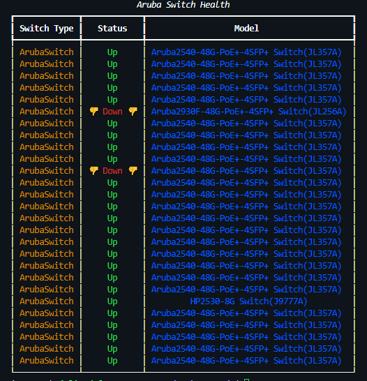

# Aruba Central Switch Health

This is just a simple attempt to write a script to quickly check the status of switches in our environment. I removed serials and what not because reasons. Traditionally I work with Ansible a lot more so please be kind and rewind your opinions haha, I kid. I hope you enjoy and maybe it leads you to create something awesome.

## Getting started

### Installations

- `pip3 install rich`
- `pip3 install pycentral`

### Central

- Obtain API gateway URL for your environment.
- Select authentication method
- Please see pycentral docs [pycentral Git Repo](https://github.com/aruba/pycentral)

### Run script

Here is an example of the output. The script limit is set to 30, but you can increase this for your environment.

